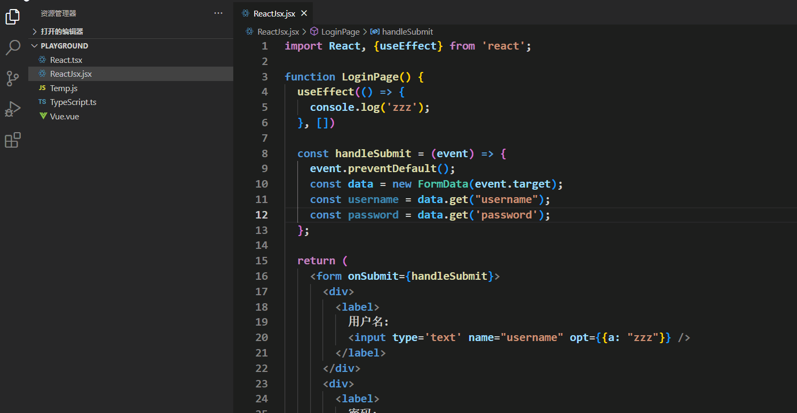

# Correct another quotation mark

When you modify one of the quotation marks, synchronize the modification of the other.

Use AST to parse the **Literal**、**TemplateLiteral** in the code, find the other pair of modified quotation marks, and synchronize the modifications.

Supported files and they used following code parsers:

- JavaScript, TypeScript, React:
  - [@babel/parser]: https://npmmirror.com/package/@babel/parser

- Vue

  - [@vue/compiler-sfc]: https://npmmirror.com/package/@vue/compiler-sfc

    